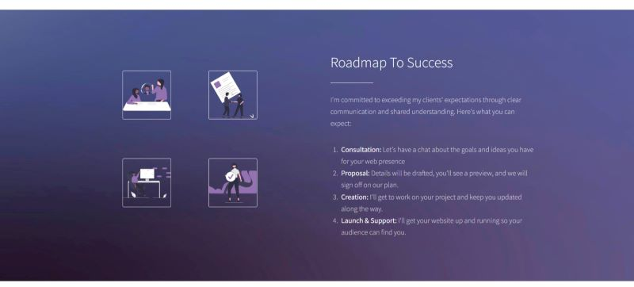
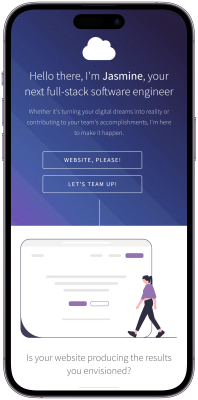
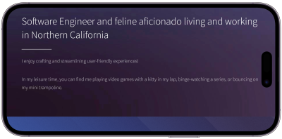

# Personal Portfolio

A beverage recipe website for both alcoholic and nonalcoholic drinks. The site allows you to search using drink names or keywords to find the ingredients, measurements and instructions for crafting your next drink.

## Table of contents

- [Overview](#overview)
  - [Screenshot](#screenshot)
  - [Links](#links)
- [My process](#my-process)
  - [Built with](#built-with)
  - [Continued development](#continued-development)
- [Author](#author)

## Overview

### Screenshot

### Links

- Repository URL: [Here](https://github.com/codewithjazzy/portfolio)
- Live Site URL: [Here](https://jasminetaylor.dev/)

## My process

### Built with

  
   
  

### What I learned

I learned how to make a custom favicon

### Continued development

This is always a WIP and with time, I'd like to work on a few more ideas:

- Separate pages for content
- Working contact form
- Résumé link

## Author
- LinkedIn - [@CodeWithJazzy](www.linkedin.com/in/codewithjazzy)
- Twitter - [@CodeWithJazzy](https://twitter.com/CodeWithJazzy)

